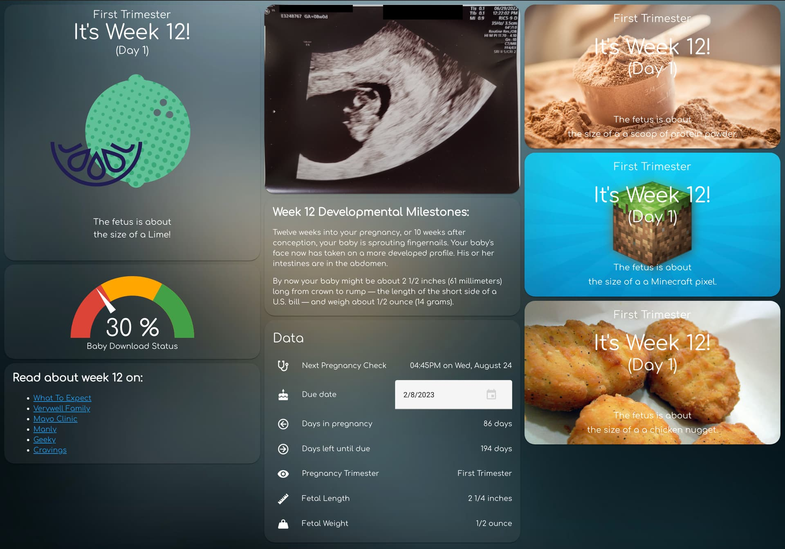

# Pregnancy Dashboard for HomeAssistant

I wanted to share a pregnancy tracking setup for HomeAssistant. Originally created by [alexives](https://github.com/alexives), this project has grown exponentially while still retaining it's primary function of providing a pregnancy tracking setup that does not track and sell your information. 

This was originally posted on a [HomeAssistant Community Post](https://community.home-assistant.io/t/pregnancy-tracking-privately-with-tempalate-sensors/270583), but I find it much easier to post updates to code in a github repo. This repository is meant to provide you as many pieces of informaiton as possible, allowing you to limit it to what you like by simpling omiting lines of code.

***Note:** For the lovelace view, you will need to add [custom:text-element](https://github.com/custom-cards/text-element), [custom:card-templater](https://github.com/gadgetchnnel/lovelace-card-templater), and [custom:gallery-card](https://github.com/TarheelGrad1998/gallery-card).*
  

  
### Sensors/Attributes Available
- Date of Next Checkup
- Number of days into pregnancy
- Number of days remaining in pregnancy
- Week into the pregnancy
- Day of the week
- Pregnancy Percent
- Fetal Length (inches)
- Fetal Weight (ounces/lbs)
- Trimester
- Fetal Development (week by week description of what's going on inside)

#### Baby Size Comparisons with Pictures
- Fruit
- Manly
- Geeky
- Food Cravings
- Dude Dad (no pictures)

#### Input Helpers You Will Need To Create
- First Day of Last Period: `input_datetime.pregnancy_last_period`
- Due Date: `input_datetime.pregnancy_due_date`
- Pregnancy Offset (for twins or non-standard pregnancies): `input_number.pregnancy_size_offset`

#### Data Sources
- [What To Expect](https://www.whattoexpect.com/)
- [Babysizer](https://babysizer.com/)
- [Verywell Family](https://www.verywellfamily.com/)
- [Mayo Clinic](https://www.mayoclinic.org/healthy-lifestyle/pregnancy-week-by-week/in-depth/hlv-20049471)
- [Dude Dad: A Dude's Guide to Baby Size Book by Taylor Calmus](https://www.dudedad.com/pages/dudes-guide-to-baby-size) 

### Contributions
Many thanks to everybody who helped with this project, regardless of the capacity.
- [alexives](https://github.com/alexives) (original creator)
- [raphi](https://community.home-assistant.io/u/raphi/summary)
